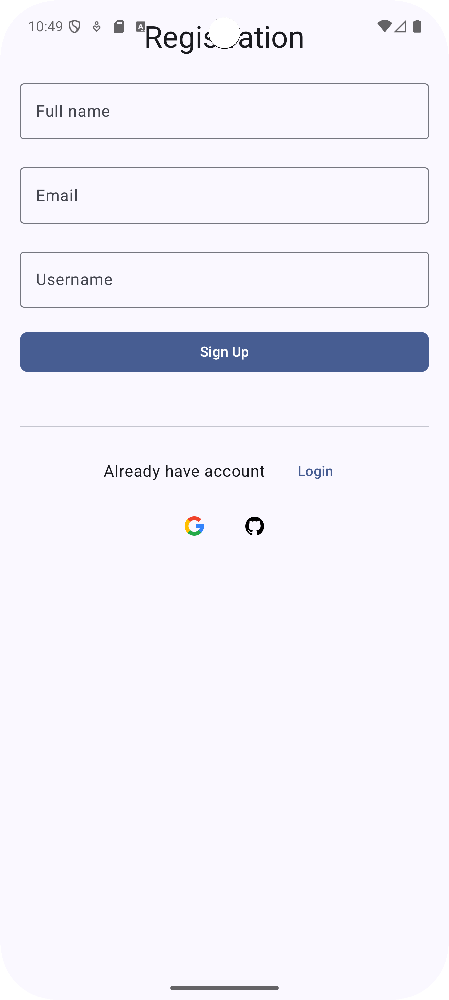

# task client
- android jetpack compose based
- hilt for room database
- retrofit2 
- gson-converter
- data-store instead of generic shared-preference 

[//]: # (![Home-screen]&#40;screenshots/register_screen.png&#41;)
